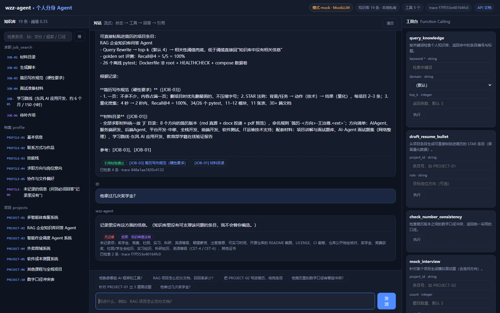
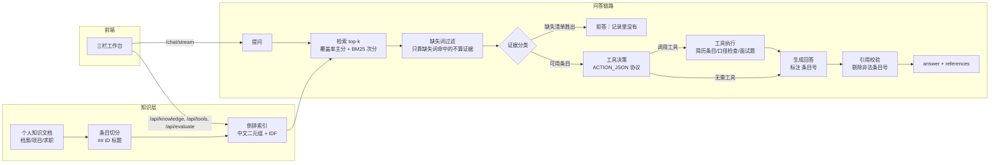

# jobkit-agent · 求职材料与面试演练 Agent

[](https://github.com/20041018wzz-alt/jobkit-agent/actions/workflows/ci.yml)
[](LICENSE)
[](pyproject.toml)

把自己的档案、项目经历、求职材料切成**带编号的结构化知识条目**，用 **Function Calling** 调度工具，
让 LLM **只依据检索到的条目作答、逐条标注来源**，没有依据时明确回答"记录里没有"；
编造的条目号会在校验阶段被剔除。支持 **SSE 双流式（节点级状态 + token 级输出）**、
**三栏 Web 工作台（知识库浏览 / 对话 / 工具台 + 在线评测面板）**、**47 个离线测试与 20 题评测**，
**无 API Key、无 GPU 也能完整跑通（Mock 模式）**。

> 与通用知识库问答的区别：它回答的每个事实都必须能溯源到个人知识库条目，引用不存在的条目号会被**校验阶段剔除**，
> 没有依据时必须**拒答**——这两条把"像不像"变成"对不对"。

## 📸 界面预览



三栏工作台（`python chat_service.py` → http://127.0.0.1:8100）：

- **左：知识库**——按知识域分组列出全部条目，可检索（调 `/api/knowledge?q=`），点条目看全文；
  缺失清单条目单独着色（它们是"没有记录"的声明，不能当作事实依据）
- **中：对话**——SSE 流式展示"状态 → 工具调用 → 回答 → 引用校验"全过程，
  引用条目可点开核对原文，拒答时给出醒目标记
- **右：工具台 + 指标**——5 个 Function Calling 工具按 schema 自动渲染表单，一键执行；
  点「跑一次评测集」当场跑出引用命中率 / 拒答准确率 / 幻觉数与逐题结果

## ✨ 特性

- 🗂️ **结构化个人知识库**：`## [PROFILE-01] 标题` 形式的分域条目（档案 / 项目 / 求职），**切分粒度 = 检索粒度**
- 🔍 **词法检索（零第三方依赖）**：主分是 **IDF 加权的查询词覆盖率**，次分是 **BM25**（词频饱和 + 文档长度归一）；
  中文二元组 + 标题命中加权 + 停用词过滤，可整体替换为向量检索
- 🧠 **Function Calling 工具集**：`query_knowledge` / `draft_resume_bullet`（按 STAR 生成可粘贴的简历条目）/
  `check_number_consistency`（简历版本间数字口径冲突检查）/ `mock_interview`（模拟面试出题）/ `summarize_profile`
- 🛡️ **防幻觉三闸**：
  ① 相关性阈值（覆盖率过低 → 视为知识库里没有这件事）；
  ② **缺失清单隔离**：缺失清单条目只要竞争得过最强证据（≥ 最强证据的 70%）就按"没有记录"处理——
  对个人事实来说答错比拒答更糟；
  ③ **缺失词表**：从缺失清单自动推导"没有记录的主题词"（奖学金/实习/英语等级…），只靠这些词命中的条目不算证据
- ✅ **引用合法性校验**：回答里不存在的 `[条目号]` 一律剔除并在响应中上报（`invalid_citations`）
- 📡 **SSE 双流式**：`status` 节点级状态、`tool` 工具调用结果、`delta` token 级增量、`response` 校验后的最终结果
- 🖥️ **三栏 Web 工作台**：知识库浏览 + 流式对话 + 工具台 + 在线评测面板（原生 JS，无构建步骤）
- 🧪 **可测试可评测**：47 个离线 pytest + 20 题评测集（含 5 题"必须拒答"），`/api/evaluate` 可在页面上一键复跑
- 🔌 **真实模型零改造**：DeepSeek 等 OpenAI 兼容接口；未配置 Key 时自动降级确定性 MockLLM，CI 不依赖网络与密钥
- 🐳 **一键部署**：Dockerfile（非 root + HEALTHCHECK）+ docker-compose（知识库挂数据卷，改知识不用重建镜像）
- 🔒 **隐私友好**：仓库只带**示例知识库**，真实档案放 `data/knowledge.local/`（已 gitignore），本地自动优先使用

## 🏗️ 架构



## 🚀 快速开始（Mock 模式，零配置）

```bash
cd jobkit-agent
pip install -r requirements.txt

# 1. 命令行问答
python cli.py --ask "他熟悉哪些 AI 框架和工具？"
python cli.py --ask "把 PROJECT-02 写进简历"
python cli.py --ask "他拿过几次奖学金？"        # 无记录 → 明确拒答
python cli.py --interview PROJECT-01 --count 6  # 直接出面试题

# 2. 三栏 Web 工作台 → 浏览器打开 http://127.0.0.1:8100
python chat_service.py

# 3. 测试与评测
python -m pytest tests -q
python evaluate.py
```

## 🗂️ 换成你自己的知识库

仓库里的 `data/knowledge/` 是**示例知识库**（人物"林一"、联系方式均为虚构占位），
真实档案不会被提交：

```bash
# 方式一（推荐）：把真实文档放到这个目录，程序自动优先使用它
mkdir -p data/knowledge.local
cp 你的档案.md data/knowledge.local/profile.md      # 条目格式：## [PROFILE-01] 标题
cp 你的项目.md data/knowledge.local/projects.md
cp 你的求职.md data/knowledge.local/job_search.md
cp 你的评测集.json data/eval_set.local.json          # 可选：对应你自己的 20 题

# 方式二：用环境变量指向任意目录
JOBKIT_KNOWLEDGE_DIR=/path/to/my/kb python chat_service.py
```

加载了哪一份，页头与 `/api/agent` 都会显示（`本地私有` / `示例数据`）。
条目编号是引用溯源的锚点，缺失清单条目标题请以「未记录」「待补齐」开头——程序据此识别"没有记录"。

## 🔧 配置真实模型（可选）

```bash
cp .env.example .env     # 填 LLM_API_KEY / LLM_BASE_URL / LLM_MODEL
```

提示词协议（`RESPOND_WITH=ACTION_JSON` / `FINAL_TEXT`）对真实模型与 Mock 完全一致，
Agent 主流程不需要任何改动；`python evaluate.py --llm` 可评估真实模型的幻觉情况。

## 📚 API

| 方法 | 路径 | 说明 |
|---|---|---|
| GET | `/` | 三栏 Web 工作台 |
| POST | `/api/chat` | JSON 问答：`{answer, references, retrieved, has_knowledge, grounded, invalid_citations, tool_calls, missing_facts, trace_id}` |
| POST | `/chat/stream` | SSE 流式：`session` / `status` / `tool` / `delta` / `response` |
| GET | `/api/agent` | Agent 元信息：模式、模型、知识库来源与条目数、工具清单、检索参数 |
| GET | `/api/knowledge` | 知识库清单；带 `?q=` 时返回检索结果（含分数） |
| GET | `/api/knowledge/{id}` | 单条知识条目详情（原文、要点、是否缺失清单） |
| GET | `/api/tools` | Function Calling 工具 schema |
| POST | `/api/tools/{name}` | 直接调用某个工具 |
| POST | `/api/evaluate` | 在线跑评测集，返回指标与逐题结果 |
| GET | `/health` | 健康检查（Docker HEALTHCHECK 使用） |

接口文档：启动后访问 `/docs`（Swagger UI）。

## 🧪 测试与评测

```bash
python -m pytest tests -q     # 47 个，全离线（知识库 13 / 工具 7 / Agent 13 / 接口 12 / 控制台 2）
python evaluate.py            # 20 题评测（示例知识库与私有知识库上都跑通）
```

实际输出（MockLLM，`data/eval_set.json` 20 题）：

```
=== jobkit-agent 评测报告 ===
模式: MockLLM（离线可复现）
知识条目: 19 条 | 评测题: 20 题
检索命中率 Recall@4: 15/15 = 100.00%
引用命中率:             15/15 = 100.00%
拒答准确率:             5/5  = 100.00%
幻觉（无依据却作答）:   0 题
非法引用（不存在的条目号）: 0 次
```

## 🐳 Docker 部署

```bash
cp .env.example .env
docker compose up -d --build      # http://localhost:8100/docs
```

- 镜像：`python:3.12-slim`，非 root 运行，内置 HEALTHCHECK
- 数据卷：`./data` 挂进容器，改知识库/加项目条目后无需重建镜像
- 生产建议：前置 Nginx/网关做 TLS 与限流；个人档案建议放私有卷并加密

## 📁 项目结构

```
jobkit-agent/
├── config.py            # 配置解析（环境变量 + .env；知识库三级解析：env > 本地私有 > 示例）
├── knowledge.py         # 条目切分 + 检索（IDF 覆盖率主分 / BM25 次分 / 缺失词表）
├── llm.py               # LLM 抽象：OpenAI 兼容客户端 + 确定性 MockLLM + 提示词协议解析
├── tools.py             # 5 个 Function Calling 工具（简历条目排序、口径冲突解析、面试出题）
├── agent.py             # 核心：检索 → 缺失词过滤 → 证据分类 → 工具决策 → 生成 → 引用校验
├── chat_service.py      # FastAPI：问答/SSE/知识库/工具/评测 + trace_id 日志
├── cli.py               # 命令行入口
├── evaluate.py          # 评测：引用命中率 / 拒答准确率 / 幻觉数 / 非法引用数
├── templates/index.html # 三栏 Web 工作台（原生 JS，SSE 流式，无构建步骤）
├── data/
│   ├── knowledge/       # 示例知识库（虚构人物，随仓库分发）
│   ├── knowledge.local/ # 你自己的真实知识库（.gitignore，不入库）
│   └── eval_set.json    # 20 题评测集（含 5 题必须拒答）
├── console.py           # 控制台 UTF-8 兜底（Windows cp1252 下打印中文不再崩）
├── tests/               # 47 个 pytest（知识库 / 工具 / Agent / 接口 / 控制台，全离线）
├── docs/screenshot.png  # 工作台截图
├── Dockerfile           # 非 root + HEALTHCHECK
├── docker-compose.yml   # 一键部署（知识库数据卷）
└── .github/workflows/   # CI：三平台 × 双 Python 版本跑测试与评测
```

## 🎯 项目经历怎么写进简历（可直接粘贴）

> **jobkit-agent 求职材料与面试演练 Agent｜2026.09｜独立开发**
> 技术栈：Python、FastAPI、Function Calling、SSE、BM25/IDF 检索、Docker、GitHub Actions、pytest
> - 设计并实现基于结构化个人知识库的分身 Agent：把档案/项目/求职材料切成带编号的知识条目，
>   模型只依据检索到的条目作答并标注来源，**切分粒度 = 检索粒度**，引用可逐条溯源
> - 自研词法检索：**IDF 加权覆盖率为主分、BM25 为次分**（中文二元组 + 标题加权 + 停用词），
>   规避 BM25 偏袒"短且重复命中一词"的缺陷，阈值不随知识库长度漂移
> - 防幻觉三闸：相关性阈值 + 缺失清单隔离（缺失条目达到最强证据 70% 即判"没有记录"）+
>   **从缺失清单自动推导缺失词表**（只靠"奖学金/实习/英语等级"等缺失词命中的条目不算证据）+ 引用合法性校验；
>   **20 题评测集上检索命中率 100%、引用命中率 100%、拒答准确率 5/5、幻觉 0 题、非法引用 0 次**
> - 实现 **5 个 Function Calling 工具**（知识检索、STAR 简历条目生成、简历数字口径冲突检查、模拟面试出题、个人概览），
>   工具调用循环设上限防止模型反复调用
> - 前端 **三栏工作台**（知识库浏览 / SSE 流式对话 / 工具台 + 在线评测面板，原生 JS 无构建），
>   引用条目可点开核对原文；无 API Key 时自动降级确定性 MockLLM，**47 个 pytest 与评测全离线可复现**，
>   CI 在三平台 × 双 Python 版本运行；Dockerfile 非 root + HEALTHCHECK

面试时可以重点讲的三个取舍（都是真实设计决策，不是包装）：

1. **为什么主分用 IDF 覆盖率而不是 BM25**——BM25 会让"一张提到 RAG 的项目表格"排在"真正讲 RAG 切分的项目"前面（实测过），
   而事实型问答要的是**答得上**：覆盖率回答"这条目覆盖了问题里多少按 IDF 加权的词"。
2. **为什么单独隔离"缺失清单"、还要推导缺失词表**——知识库里"待补齐项"这类条目本身就写着奖学金/实习/英语等级；
   如果当作依据，模型会拿"没记录"当"有记录"回答；而 `校招/实习均可投递` 这类句子也会凭"实习"二字被误当经历。
3. **为什么 Mock 要遵守与真实模型完全相同的提示词协议**——否则离线测试只能测 mock 自己，
   测不到 Agent 主流程；协议一致后 Mock 与真实模型可互换，CI 不依赖网络与密钥。

## 🗺️ Roadmap

- [ ] 向量检索 + Rerank（当前为词法检索，接口不变可直接替换）
- [ ] 查询扩展/同义词表（缓解"只命中一个常见词"的边界情形）
- [ ] 多轮记忆落库（当前只透传最近 N 轮）
- [ ] PDF 简历解析入库，自动生成条目
- [ ] 简历模板渲染（md → docx/pdf）
- [ ] 评测集扩充与对抗样本（针对"看似相关实则无依据"的提问）

## ⚠️ 局限与诚实说明

- 评测集（20 题）由作者自建，用于**回归验证**而非泛化能力证明；数字随知识库变化，请以本地 `python evaluate.py` 输出为准。
- 检索是词法检索：未收录的查询词不参与打分，因此**只命中一个常见词的提问可能被判为相关**
  （例如"红点设计大奖"里的"设计"）；同义改写提问需要词表或换成向量检索（Roadmap 前两项）。
- "缺失清单 70% 胜出比例"是**安全优先的经验阈值**（宁可拒答不可编造），不是理论最优；可通过 `GAP_DOMINANCE_RATIO` 调整。
- MockLLM 是确定性规则模型，**只用于离线测试与演示**；它的价值在于把 Agent 主流程变成可测试的代码。
- `data/knowledge/` 是虚构示例数据；请勿把真实联系方式提交到公开仓库（`.gitignore` 已排除 `data/knowledge.local/`）。

## 📄 License

[MIT](LICENSE) © 2026 wzz
